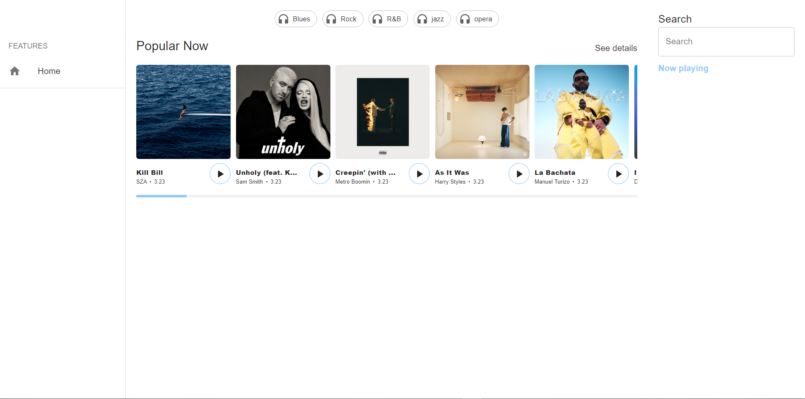
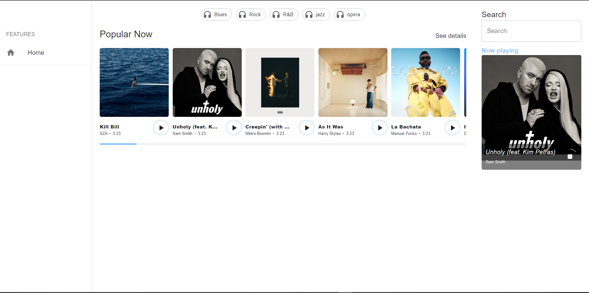
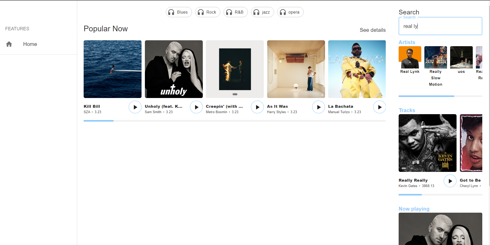
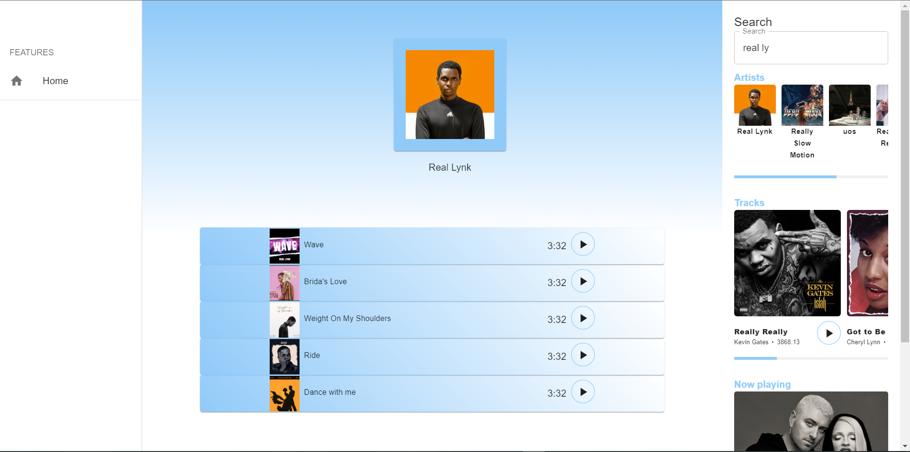

#  MUSIK - A noob music player built on spotify API

Disclaimer - this is a noobie project, do not judge me like a pro

This is a noobie project i worked on to get a better understanding of react router and react mui components

## Table of contents

- [Overview](#overview)
  - [The challenge](#the-challenge)
  - [Screenshot](#screenshot)
  - [Links](#links)
- [My process](#my-process)
  - [Built with](#built-with)
  - [What I learned](#what-i-learned)
  - [Continued development](#continued-development)
  - [Useful resources](#useful-resources)
- [Author](#author)

**Note: Delete this note and update the table of contents based on what sections you keep.**

## Overview
so i implemented the 26 second music player(😂 thats the longest songs are on this player) using spotify Api but by using the [client Credential flow](https://developer.spotify.com/documentation/general/guides/authorization/client-credentials/), so that users can use this app without logging into their spotify account

### The challenge

Users should be able to:

- search for songs, with autoCompletion
- play songs
- visit artist page displaying their top songs

### Screenshot
so at first it looks like the image below, appalling right, yeah i know, real example of don't judge a book by its cover😂 

from the homePage straight away you can play songs just by clicking the play icon,
when you click play the awsome custom player appears

the page becomes less apalling when you start searching for songs, just start typing the name of any artist or song that intrests you

in the artist Card that appears and you'll be navigated to an artist page with the artist's top songs

### Links

- Solution URL: [solution URL](https://github.com/OVIfy/frontend-mentor-bookmark-landing-page)
- Live Site URL: [live site URL](https://stunning-tartufo-38939c.netlify.app/)

## My process

### Built with
- reactjs
- react router
- react mui components

### What I learned
- [client Credential flow  authorization](https://developer.spotify.com/documentation/general/guides/authorization/client-credentials/)
- A better understanding of the useRef hook
- loader and useLoderData hook for react router dom
- customizing react mui components
- fetching req params in react router using loader function

### Continued development
- my code is messy, i follow no standard whatsoever, i'll work on writing more organized, easily understandable and collaborative code

- i'll also love to start learning frontend test tools

### Useful resources

- [Spotify Api console](https://developer.spotify.com/console/) - This helped me test the api, know what header params they required and the kind of objects they returned

-   [client credentials authorization flow](https://developer.spotify.com/documentation/general/guides/authorization/client-credentials/) - This helped me understand how to make requests to spotify API without logging users in

## Author

- Website - [have none yet](https://www.your-site.com)

**Note: Delete this note and add/remove/edit lines above based on what links you'd like to share.**

